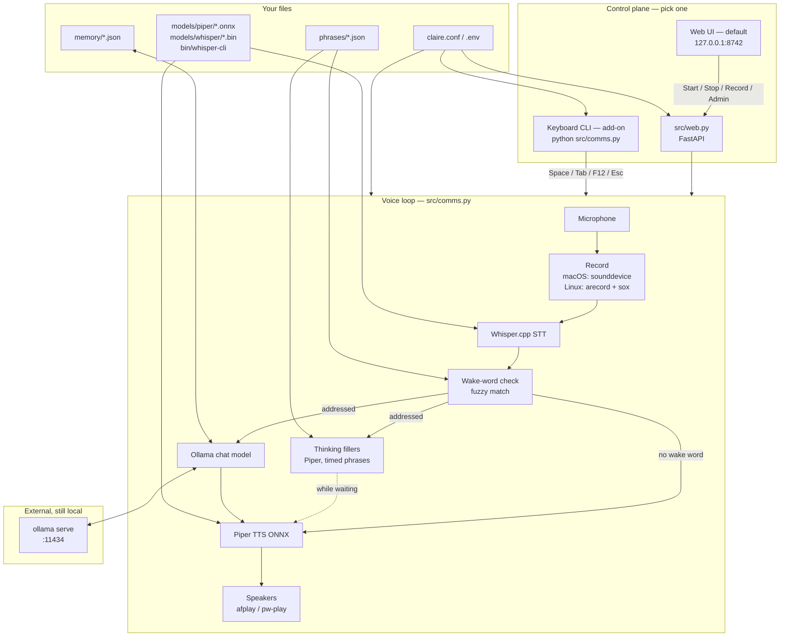

# CLAIRE

**C**onversational **L**ocal **A**udio **I**ntelligent **R**untime **E**ngine

A fully configurable voice layer for local LLMs (Ollama — Llama, Qwen, Mistral, and others). In short: **giving local AI models a voice** so you can talk to them.

| Letter | Stands for |
|---|---|
| **C** | **Conversational** — speak and be spoken to, not a chat box |
| **L** | **Local** — models run on your machine via Ollama, not a token API |
| **A** | **Audio** — Whisper in, Piper out |
| **I** | **Intelligent** — any chat/instruct LLM you pull |
| **R** | **Runtime** — Start/Stop loop, memory, fillers, wake word |
| **E** | **Engine** — the plumbing that ties those pieces together |

macOS and Linux. You run CLAIRE in the **web UI** at [http://127.0.0.1:8742](http://127.0.0.1:8742) — Start, Record, Admin, Shut down. A keyboard CLI is available as an add-on. Windows is not supported yet.

**Linux is complete and tested** on Fedora / Nobara: web UI voice loop (Whisper in, Piper out, local Ollama), wake word, interrupt, Stop vs Shut down. macOS was the original path. The clone is still plumbing — you install Ollama, `whisper-cli`, and models.

Current release: **0.2.2** (see `version` in `pyproject.toml`). The UI header and `GET /api/status` show the same value.

## Architecture

Nothing leaves the machine except what you already run locally (Ollama on `127.0.0.1`). The product is the **web UI** (`python src/web.py`): browser on `127.0.0.1:8742`, Admin, Start / Stop / Record. The keyboard CLI is an add-on for the same voice loop and `claire.conf`. Pick one — two instances are not supported.



**Turn flow:** Record → Whisper transcript → fuzzy wake word → if missing, Piper speaks a canned line; if present, Ollama generates (fillers may speak while you wait) → Piper speaks the reply → turn is appended to `memory/`. In the web UI, Admin can edit config and phrases while running; those files apply on the next **Stop / Start**.

## Credits

- **Design and product:** Philip Santiago (Design Engineer/Grok Prompter).
- **Implementation:** Grok (xAI) (the plumber).

This project is a **hobby** and an **exercise of xAI products** plus the designer’s imagination. The spoken name defaults to **Claire**.

## Warnings

### Shared use — no warranty, no responsibility

This repository is shared **as-is** for others to copy, fork, and run at their own risk.

The **author (Philip Santiago)** and the **implementer (Grok / xAI)** take **no responsibility** for misuse, misappropriation, copies, derivatives, damage to hardware or data, privacy outcomes, or any other consequence of using this software. You are solely responsible for how you deploy it, which models you download, and whether that use is lawful.

See also [LICENSE](LICENSE) (MIT). Model files you add have **their own licenses**; this repo’s MIT license does not cover them.

### No moderation — use at your own risk

This project does **not** apply content moderation, safety filters, or profanity checks on wake words, pre-canned phrases, transcripts, or model replies.

You can set any wake word, any phrase list, and any local LLM. That includes vulgar, sexual, hateful, or otherwise inappropriate wording and “joke” names (for example **Michael Hunt**, **Al Coholic**, and the like). Speech-to-text will transcribe what was said; Piper will speak what the model returns.

The repository owner and implementer are **not liable** for such misuse, for copies of this software used that way, or for any context users generate. If you run it, you own the output and the consequences. **Use at your own risk.**

### This is not a complete product in the clone

The git tree is **plumbing**. It will not speak until **you** install and run the rest:

- Python 3.9+
- [Ollama](https://ollama.com) with `ollama serve` on `127.0.0.1:11434`
- At least one **chat/instruct** LLM (`ollama pull …`)
- `whisper-cli` in `bin/` ([whisper.cpp](https://github.com/ggml-org/whisper.cpp))
- A whisper.cpp **ggml** file in `models/whisper/`
- Piper **ONNX + matching `.onnx.json`** in `models/piper/` (from [piper-voices](https://huggingface.co/rhasspy/piper-voices) only)
- A microphone
- **macOS:** Terminal/Python mic permission
- **Linux:** `alsa-utils`, `sox`, and `pw-play` / `paplay` / `aplay`

Without Ollama running, **Start is locked**. Without models in those folders, the dropdowns are empty or speak-time fails. Defaults in `claire.conf.example` are **examples**, not a supported catalog. Swap Piper, Whisper, and Ollama models as you like; the UI only lists what you already downloaded.

### Know the limits of your machine

- **Preferred:** a **GPU** (or Apple Silicon with enough unified memory) for the LLM. That is the intended experience.
- **Supported:** **CPU-only** Ollama will run, but replies are often slow, fillers will fire constantly, and the voice loop feels **undesirable**. Do not expect a 7B–14B chat model to feel snappy on a weak CPU.
- A 7B-class model wants on the order of **8 GB+ RAM** free; 14B needs more; 70B can lock the machine. Disk for each pull is several GB.
- Embedding-only, vision-only, or long “reasoning” models are a poor fit for spoken back-and-forth.

## LLMs used in this project

These are Ollama models **we have actually run** here. They are **not** shipped in git. Pull only what your machine can hold. Listing a model does not mean we support every update or every other pull from the Ollama library.

| Ollama name | Publisher | Role here | Notes |
|---|---|---|---|
| `qwen2.5:7b` | Alibaba (Qwen) | Default example | Solid spoken chat; wants ~8 GB+ RAM (GPU / Apple Silicon preferred) |
| `llama3.2:3b-instruct-q8_0` | Meta | Earlier default / rollback | Smaller and snappier; weaker answers |
| `mistral-nemo` | Mistral AI + NVIDIA | Larger assistant | ~12B; better on GPU; CPU is often too slow |

Install one with `ollama pull <name>`, then pick it in the UI. CPU-only will run but is usually an **undesirable** voice experience.

### Whisper (STT) used here

whisper.cpp **ggml** files only. Put them in `models/whisper/` and point `whisper_model` at the file. You still need `bin/whisper-cli` built for your OS.

| File | Source | Role here | Notes |
|---|---|---|---|
| `ggml-base.en.bin` | [ggerganov/whisper.cpp](https://huggingface.co/ggerganov/whisper.cpp) | Default English STT | Example download in `scripts/download-models.sh`. English-only. Larger ggml files (`small`, `medium`) are slower and not required. |

Other Whisper formats (OpenAI `.pt`, Hugging Face Transformers, etc.) **will not load**.

### Piper voices (TTS) used here

Piper **ONNX** from [rhasspy/piper-voices](https://huggingface.co/rhasspy/piper-voices) only. Hugging Face lists **two required downloads** per voice, from the **same folder**:

- `name.onnx` — the voice weights
- `name.onnx.json` — Piper config (sample rate, phoneme map, speakers). Speak fails without it. **Download this file too.** Do not create it by hand.

Put both in `models/piper/`. The UI lists `.onnx` files in that folder; synthesis still needs the sibling `.json`.

Open the JSON and check **`phoneme_type`**. CLAIRE shells out to `piper-tts` with no extra phonemizer packages, so only **espeak** works out of the box:

| `phoneme_type` in the JSON | Out of the box? |
|---|---|
| `espeak` (or the key is missing) | **Yes** — English, Italian, Spanish, French, German, and most [piper-voices](https://huggingface.co/rhasspy/piper-voices/tree/main) folders |
| `japanese` | No — needs OpenJTalk / `pyopenjtalk` (example: `ja_JP-hi_fi_captain-medium`) |
| `thai` | No — needs `tltk` (example: `th_TH-tsync2-medium`) |
| `pinyin` | No — needs g2pW (examples: `zh_CN-chaowen-medium`, `zh_CN-xiao_ya-medium`) |

Older Chinese `zh_CN-huayan-*` is `espeak` and can load; `he_IL-*` uses a Hebrew path bundled in Piper 1.8 and is untested here. If `phoneme_type` is anything other than `espeak`, expect a Piper traceback unless you install that extra stack yourself.

| Voice (file stem) | Locale | Role here | Notes |
|---|---|---|---|
| `en_US-libritts_r-medium` | US English | Original / example | Multi-speaker; `voice_speaker` picks among hundreds of ids (default `0`). Fetched by `scripts/download-models.sh`. |
| `en_GB-jenny_dioco-medium` | UK English | Added from HF sample | Single-speaker; keep speaker id `0`. |
| `en_GB-northern_english_male-medium` | UK English | Added from HF sample | Single-speaker. |
| `en_US-amy-medium` | US English | Added from HF sample | Single-speaker. |

These files are **gitignored** (often 50–80 MB each). Drop in replacements from the Piper repo; random Hugging Face TTS packages will not work. Language of the voice should match what you speak. Default STT (`ggml-base.en.bin`) is English-only.

## Security

Run this **on your machine**, not as a public website.

- Copy `.env.example` → `.env` if you need env overrides. **Never commit** `.env`, `claire.conf`, `memory/`, `models/`, or `bin/`.
- The UI binds **`127.0.0.1`** by default. Do not set `CLAIRE_UI_HOST=0.0.0.0` unless you accept that anyone on the LAN can start/stop the mic and the assistant.
- There are **no cloud API keys** in this project. Keep it that way, or put secrets only in `.env`.

## Setup

```bash
git clone https://github.com/YOUR_USER/CLAIRE.git
cd CLAIRE
python3 -m venv venv
source venv/bin/activate
pip install -r requirements.txt
cp claire.conf.example claire.conf
cp .env.example .env
chmod +x scripts/download-models.sh
./scripts/download-models.sh
```

Put `whisper-cli` in `bin/`. Piper’s CLI is `venv/bin/piper` from `pip`. Then:

```bash
ollama pull qwen2.5:7b
```

### Linux packages

```bash
# Fedora / Nobara
sudo dnf install alsa-utils sox pipewire-utils

# Debian / Ubuntu
sudo apt install alsa-utils sox pipewire-utils pulseaudio-utils
```

Add your user to the `audio` group if capture is silent, then log out and back in.

## Run

The usual way to run CLAIRE is the **web UI**.

Terminal 1:

```bash
ollama serve
```

Terminal 2 (venv on):

```bash
source venv/bin/activate
python src/web.py
```

Open [http://127.0.0.1:8742](http://127.0.0.1:8742).

- Web Menu → **Admin settings** for models, paths, microphone, and canned speech. The UI writes `claire.conf`.
- **Start**, then **Record** / **Stop recording**. **Interrupt** stops speech.
- Say the **wake word** plus your request.
- **scratch that, scratch that** starts a new memory session.
- Spoken **exit** / **goodbye** / **shut down** is **Stop** (voice loop off; the page stays up).
- Web Menu **Shut down** exits the UI process.
- If port **8742** is already in use, the process does not start.

### Optional: keyboard CLI

Add-on for the same loop and `claire.conf`. No Admin — change settings in the web UI (or the file), then Start. Do not run this while the web UI is up.

```bash
source venv/bin/activate
python src/comms.py
```

Space Start/Stop · Tab Record · F12 Interrupt · Esc Shut down. Spoken goodbye is Stop. If Ollama is not running, the CLI prints an error and **exits**.

Offline check (no mic, no generate):

```bash
python scripts/smoke_test.py
```

## Config

Copy `claire.conf.example` → `claire.conf` (gitignored). The UI writes that file. Env vars `CLAIRE_*` override it.

| Setting | Env | Default |
|---|---|---|
| Ollama model | `CLAIRE_LLM_MODEL` | `qwen2.5:7b` |
| Piper voice | `CLAIRE_VOICE_MODEL` | `models/piper/en_US-libritts_r-medium.onnx` |
| Piper speaker id | `CLAIRE_VOICE_SPEAKER` | `0` |
| Whisper binary | `CLAIRE_WHISPER_BIN` | `bin/whisper-cli` |
| Whisper model | `CLAIRE_WHISPER_MODEL` | `models/whisper/ggml-base.en.bin` |
| Piper binary | `CLAIRE_PIPER_BIN` | `venv/bin/piper` |
| Memory directory | `CLAIRE_MEMORY_DIR` | `memory/` |
| Use conversation memory | `CLAIRE_MEMORY_ENABLED` | `1` (on) |
| Memory to load (%) | `CLAIRE_MEMORY_LOAD_PCT` | `100` (most recent; slider if >100 turns) |
| Microphone (Linux) | `CLAIRE_MIC_DEVICE` | auto |
| Wake word | `CLAIRE_WAKE_WORD` | `claire` |
| Preferred mix (%) | `CLAIRE_PREFERRED_BOOST` | `0` (equal pick) |
| Wake-word match (%) | `CLAIRE_WAKE_FUZZ` | `85` (50–100, fuzzy) |

Drop extra Piper voices in `models/piper/` (**both** `name.onnx` and `name.onnx.json` from the same Hugging Face directory) and extra Whisper `ggml-*.bin` in `models/whisper/`, then refresh. Pull more LLMs with `ollama pull`. Catalogs: [Piper](https://huggingface.co/rhasspy/piper-voices), [Ollama](https://ollama.com/library), [whisper.cpp models](https://huggingface.co/ggerganov/whisper.cpp). Listing a file does not mean it is tested.

Speaker id only matters for multi-speaker voices.

Conversation memory is **on by default**. Turns are stored only when Ollama replies. **Stop** writes nothing extra if that Start/Stop cycle had no replies. **Start** loads the store into RAM (Record stays off until that request finishes — so Start then Record one second later still has history). The model sees history on the **first spoken turn**, not in a separate preload generate. Under 100 turns, the recency window is all of them. Over 100, Admin shows a **most-recent %** slider (default 100%). Each turn is tagged `good` / `similar` / `duplicate`; only **good** turns are fed (first copy of a duplicate, one exemplar of similar waffle). Toggle **Use conversation memory** next to the memory directory to disable.

If Record is silent, set **Microphone device** in Admin. After several consecutive empty recordings, the UI may warn — or you simply were not speaking.

## Runtime notes

CLAIRE is a **voice engine** around **your** Ollama model. These are how that loop behaves today.

**Wake word vs memory.** Changing the wake word **resets the experience**. The wake word is also the assistant’s name in the prompt. Old turns stay in `memory/current.json`, but user lines still say the previous name, so the model often answers like a new character. Treat a new wake word as a new conversation.

**Disk vs the running process.** `current.json` is **not** re-read on every Record. History is loaded on **Start** into RAM, then appended after each Ollama reply. Editing JSON while `python src/web.py` is running does not change what the model hears until you **Shut down** and start it again.

**What Start loads.** Start concatenates every `memory/*.json` in that folder (not subfolders). A `*_session.json` left next to `current.json` is fed again. Move old sessions into `memory/archive/` if you want them out of the prompt.

**When a turn is stored.** Only an **addressed** utterance that gets an Ollama reply is saved. Missing-wake canned lines, empty recordings, Interrupt, Start, and Stop do not write turns. Stop with no replies this cycle stores nothing extra.

**Smart tags.** Turns may be tagged `good` / `similar` / `duplicate`. The **Start** window feeds **good** (and drops extra similars/duplicates). Tags are not a live filter mid-cycle; waffle can still land in RAM until the next Start.

**Thinking / fillers.** Fillers run until the engine sees the **first** reply token. A model that **loops** (same stanza for a long time) still holds the take until generation hits the cap. Piper then speaks whatever came back. Vision tags such as `qwen2.5vl` are a poor spoken-chat fit and hedge or loop more than a text instruct model.

**Piper.** Each voice needs **both** `name.onnx` and `name.onnx.json` from the same Hugging Face folder. `phoneme_type` **espeak** (or missing) works out of the box. `japanese` / `thai` / `pinyin` need extra packages.

## Pre-canned speech

Edit in **Admin** (add on top, then **Showing Thinking Entries** / **Show Wake-word Entries**), or in `phrases/thinking.json` and `phrases/missing_wake.json`. New lines default to not preferred; tick **Preferred** to boost. Slider **0%** = original equal pick; **50%** ≈ preferred 2×; **100%** = preferred only. `{name}` in missing-wake lines is the wake word. Stop/Start to apply if the assistant is already running.

## Layout

| Path | What |
|---|---|
| `src/web.py` | FastAPI UI |
| `src/ui/index.html` | Config page |
| `src/comms.py` | Mic, Whisper, Ollama, Piper, loop, keyboard CLI |
| `pyproject.toml` | Python package metadata and default dependencies |
| `requirements.txt` | Same dependencies for `pip install -r` |
| `claire.conf.example` | Settings template |
| `.env.example` | Optional env overrides |
| `scripts/download-models.sh` | Example Whisper + Piper files only |
| `scripts/smoke_test.py` | Offline import / wake / HTTP checks |
| `phrases/*.json` | Thinking and missing-wake lines |
| `memory/`, `models/`, `bin/` | Local only — not in git |

## License

MIT. See [LICENSE](LICENSE).
